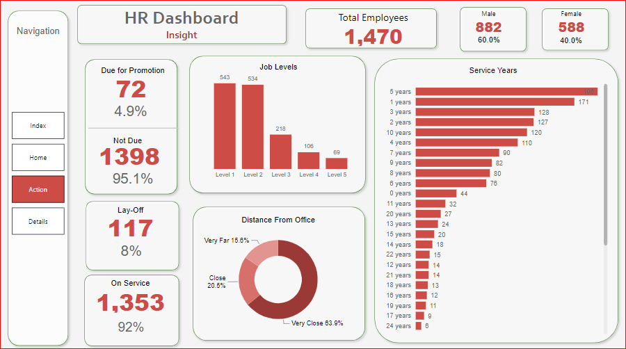

# HR Analysis

HR report is an analytical method used to display human resources-related stats, insights, and metrics with the primary purpose of improving workforce performance, recruiting procedures, and other relevant HR processes with the help of HR dashboards.

### Dataset

All files are in dataset folder. 

### Preview

#### 1st Page 

#### 2nd Page 

#### 3rd Page 

#### 4th Page 

### Conclusion

